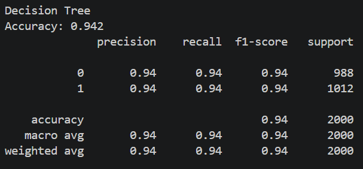
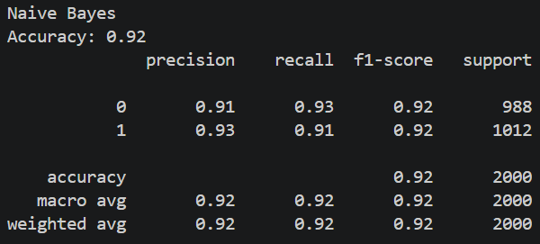
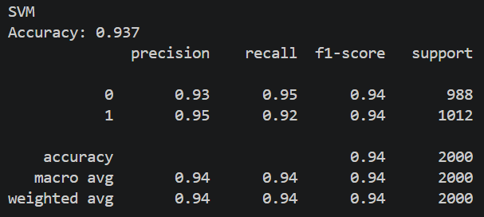

# 🍊 Klasifikasi Buah: Orange vs Grapefruit

## Deskripsi Proyek

Proyek ini bertujuan untuk membangun model machine learning untuk mengklasifikasikan buah apakah termasuk **orange (jeruk)** atau **grapefruit (anggur)** berdasarkan fitur numerik yang tersedia pada dataset.

Dataset yang digunakan:
>>> https://www.kaggle.com/datasets/joshmcadams/oranges-vs-grapefruit


## Tahapan Pembuatan Model

### 1. Import Library

Library yang digunakan:

* pandas
* numpy
* matplotlib
* seaborn
* scikit-learn


### 2. Load Dataset

Dataset dibaca menggunakan pandas:

```python
df = pd.read_csv("citrus.csv")
```


### 3. Exploratory Data Analysis (EDA)

Dilakukan untuk memahami struktur data:

* Mengecek tipe data
* Mengecek missing value
* Melihat distribusi label (orange vs grapefruit)
* Visualisasi hubungan antar fitur


### 4. Data Preprocessing

#### a. Encoding Label

Label diubah dari kategori menjadi numerik:

```python
df['label'] = LabelEncoder().fit_transform(df['name'])
```

#### b. Split Data

Dataset dibagi menjadi data latih dan data uji:

```python
train_test_split(test_size=0.2, random_state=42)
```

#### c. Feature Scaling

Dilakukan normalisasi menggunakan StandardScaler (terutama untuk SVM)


### 5. Pembuatan Model

Model yang digunakan:

* 🌳 Decision Tree
* 📊 Naive Bayes
* ⚡ Support Vector Machine (SVM)


### 6. Training Model

Setiap model dilatih menggunakan data training:

```python
model.fit(X_train, y_train)
```


### 7. Evaluasi Model

Evaluasi dilakukan menggunakan:

* Accuracy
* Precision
* Recall
* F1-score


## Hasil Evaluasi Model

### 🌳 Decision Tree



---

### 📊 Naive Bayes



---

### ⚡ Support Vector Machine (SVM)



---

## 📈 Perbandingan Akurasi

| Model         | Accuracy |
| ------------- | -------- |
| Decision Tree | 0.942    |
| Naive Bayes   | 0.920    |
| SVM           | 0.937    |

---

## Analisis

Berdasarkan hasil pengujian:

* **Decision Tree** memiliki akurasi tertinggi (94.2%) karena mampu mempelajari pola data dengan baik tanpa asumsi distribusi tertentu.
* **Support Vector Machine (SVM)** memiliki performa yang cukup tinggi (93.7%), karena mampu memisahkan data dengan margin optimal.
* **Naive Bayes** memiliki akurasi paling rendah (92%) karena asumsi independensi antar fitur tidak sepenuhnya sesuai dengan dataset.


##  Kesimpulan

Model terbaik untuk klasifikasi dataset ini adalah **Decision Tree**, karena memberikan performa paling tinggi dibandingkan model lainnya.


## Struktur Project

```
uts-ml/
│── citrus.csv
│── main.py
│── decision-tree.png
│── naive-bayes.png
│── svm.png
│── README.md
```


## 🚀 Cara Menjalankan Program

1. Install library:

```
pip install pandas numpy scikit-learn matplotlib seaborn
```

2. Jalankan program:

```
python main.py
```


## Author

Nama: (NAZWA NABILLA WIJAYA-1237050116)
